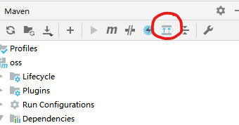
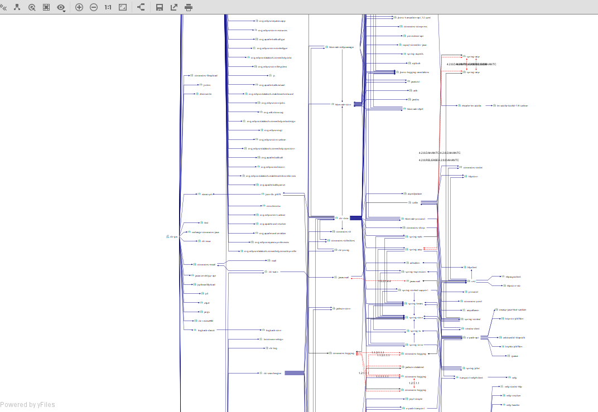
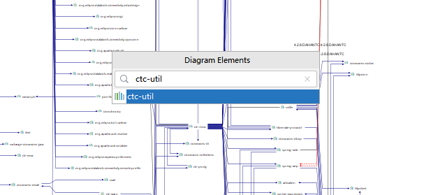
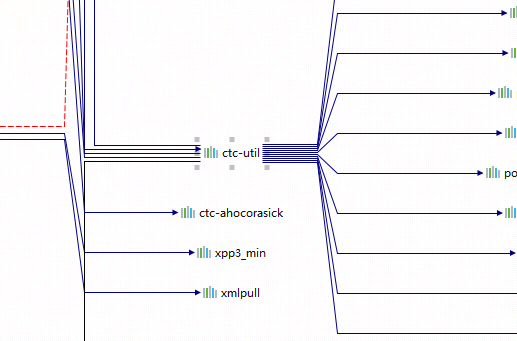
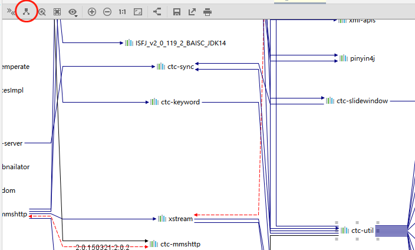
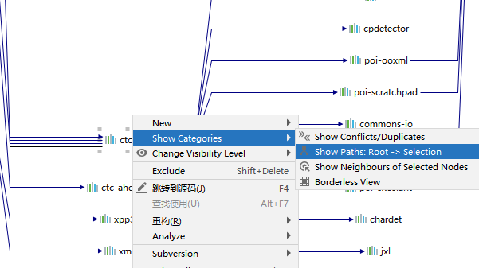
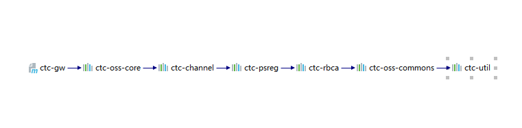

# IDEA查看一个jar包的依赖层次

## 一、打开当前项目的Maven依赖图

### 有2种方法：

* 使用快捷键`Ctrl`+`Alt`+`Shift`+`U`

* 或者点击右侧的`Maven`窗口，再点击`Show Dependencies…`图标，如图：

### 之后可以看到依赖图如下，项目中的jar包比较多的话，会非常复杂：

## 二、搜索某一个jar包

### 1、按`Ctrl`+`F`打开搜索栏，然后输入想要找的jar包，选中该jar包后按回车，即可定位到该jar包在依赖图中的位置：

### 2、之后有2种方法可以看到该jar包的依赖路径

* 点击左上角的`Show Paths:Root->Selection`按钮，如图：

* 在该jar包名上右键，在弹出菜单里依次选`Show Categories` -> `Show Paths:Root->Selection`，如图：

### 之后可以看到该jar包的依赖路径

