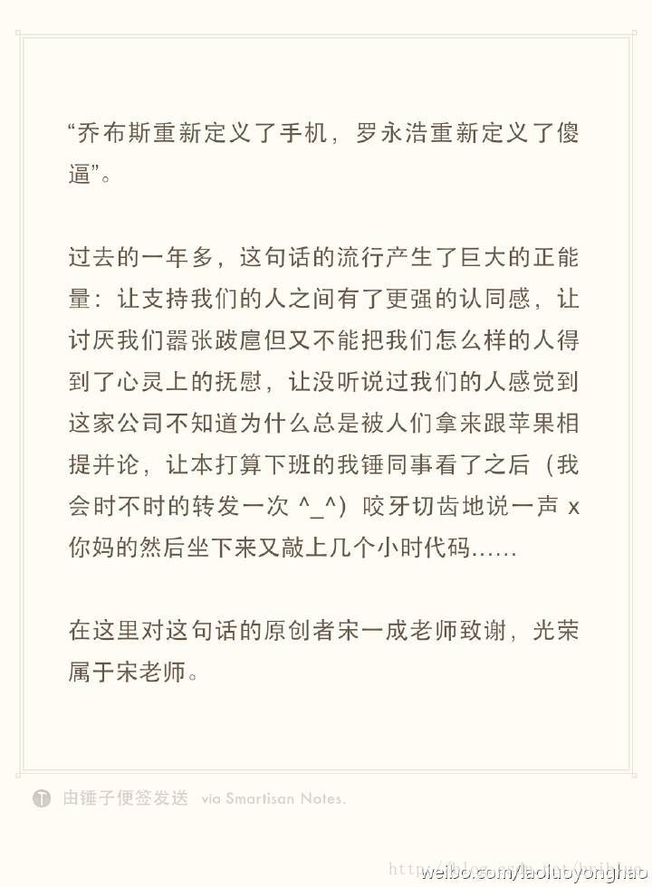

# 秒懂，Java 注解 （Annotation）你可以这样学

> 转载自：https://blog.csdn.net/briblue/article/details/73824058

---

文章开头先引入一处图片。


这处图片引自老罗的博客。为了避免不必要的麻烦，首先声明我个人比较尊敬老罗的。至于为什么放这张图，自然是为本篇博文服务，接下来我自会说明。好了，可以开始今天的博文了。

Annotation 中文译过来就是注解、标释的意思，在 Java 中注解是一个很重要的知识点，但经常还是有点让新手不容易理解。

**我个人认为，比较糟糕的技术文档主要特征之一就是：用专业名词来介绍专业名词。**

比如：
> Java 注解用于为 Java 代码提供元数据。作为元数据，注解不直接影响你的代码执行，但也有一些类型的注解实际上可以用于这一目的。Java 注解是从 Java5 开始添加到 Java 的。

这是大多数网站上对于 Java 注解，解释确实正确，但是说实在话，我第一次学习的时候，头脑一片空白。这什么跟什么啊？听了像没有听一样。因为概念太过于抽象，所以初学者实在是比较吃力才能够理解，然后随着自己开发过程中不断地强化练习，才会慢慢对它形成正确的认识。

我在写这篇文章的时候，我就在思考。如何让自己或者让读者能够比较直观地认识注解这个概念？是要去官方文档上翻译说明吗？我马上否定了这个答案。

后来，我想到了一样东西————墨水，墨水可以挥发、可以有不同的颜色，用来解释注解正好。

不过，我继续发散思维后，想到了一样东西能够更好地代替墨水，那就是印章。印章可以沾上不同的墨水或者印泥，可以定制印章的文字或者图案，如果愿意它也可以被戳到你任何想戳的物体表面。

但是，我再继续发散思维后，又想到一样东西能够更好地代替印章，那就是标签。标签是一张便利纸，标签上的内容可以自由定义。常见的如货架上的商品价格标签、图书馆中的书本编码标签、实验室中化学材料的名称类别标签等等。


所以，基于如此，我完成了自我的知识认知升级，我决定用标签来解释注解。

## 注解如同标签

回到博文开始的地方，之前某新闻客户端的评论有盖楼的习惯，于是 “乔布斯重新定义了手机、罗永浩重新定义了傻X” 就经常极为工整地出现在了评论楼层中，并且广大网友在相当长的一段时间内对于这种行为乐此不疲。这其实就是等同于贴标签的行为。

在某些网友眼中，罗永浩就成了傻X的代名词。

**广大网友给罗永浩贴了一个名为“傻x”的标签，他们并不真正了解罗永浩，不知道他当教师、砸冰箱、办博客的壮举，但是因为“傻x”这样的标签存在，这有助于他们直接快速地对罗永浩这个人做出评价，然后基于此，罗永浩就可以成为茶余饭后的谈资，这就是标签的力量。**

而在网络的另一边，老罗靠他的人格魅力自然收获一大批忠实的拥泵，他们对于老罗贴的又是另一种标签。


老罗还是老罗，但是由于人们对于它贴上的标签不同，所以造成对于他的看法大相径庭，不喜欢他的人整天在网络上评论抨击嘲讽，而崇拜欣赏他的人则会愿意挣钱购买锤子手机的发布会门票。

我无意于评价这两种行为，我再引个例子。

《奇葩说》是近年网络上非常火热的辩论节目，其中辩手陈铭被另外一个辩手马薇薇攻击说是————“站在宇宙中心呼唤爱”，然后贴上了一个大大的标签————“鸡汤男”，自此以后，观众再看到陈铭的时候，首先映入脑海中便是“鸡汤男”三个大字，其实本身而言陈铭非常优秀，为人师表、作风正派、谈吐举止得体，但是在网络中，因为娱乐至上的环境所致，人们更愿意以娱乐的心态来认知一切，于是“鸡汤男”就如陈铭自己所说成了一个撕不了的标签。

**我们可以抽象概括一下，标签是对事物行为的某些角度的评价与解释。**

到这里，终于可以引出本文的主角注解了。

**初学者可以这样理解注解：想像代码具有生命，注解就是对于代码中某些鲜活个体的贴上去的一张标签。简化来讲，注解如同一张标签。**

在未开始学习任何注解具体语法而言，你可以把注解看成一张标签。这有助于你快速地理解它的大致作用。如果初学者在学习过程有大脑放空的时候，请不要慌张，对自己说：

注解，标签。注解，标签。

## 注解语法

因为平常开发少见，相信有不少的人员会认为注解的地位不高。其实同 classs 和 interface 一样，注解也属于一种类型。它是在 Java SE 5.0 版本中开始引入的概念。

### 注解的定义

注解通过`@interface`关键字进行定义。

```java
public @interface TestAnnotation {
}
```

它的形式跟接口很类似，不过前面多了一个 @ 符号。上面的代码就创建了一个名字为 TestAnnotaion 的注解。

你可以简单理解为创建了一张名字为 TestAnnotation 的标签。

### 注解的应用

上面创建了一个注解，那么注解的的使用方法是什么呢。

```java
@TestAnnotation
public class Test {
}
```

创建一个类 Test,然后在类定义的地方加上 @TestAnnotation 就可以用 TestAnnotation 注解这个类了。

你可以简单理解为将 TestAnnotation 这张标签贴到 Test 这个类上面。

不过，要想注解能够正常工作，还需要介绍一下一个新的概念那就是元注解。

### 元注解

元注解是什么意思呢？

元注解是可以注解到注解上的注解，或者说元注解是一种基本注解，但是它能够应用到其它的注解上面。

如果难于理解的话，你可以这样理解。元注解也是一张标签，但是它是一张特殊的标签，它的作用和目的就是给其他普通的标签进行解释说明的。

元标签有 @Retention、@Documented、@Target、@Inherited、@Repeatable 5 种。

#### @Retention

Retention 的英文意为保留期的意思。当 @Retention 应用到一个注解上的时候，它解释说明了这个注解的的存活时间。

它的取值如下：

* RetentionPolicy.SOURCE 注解只在源码阶段保留，在编译器进行编译时它将被丢弃忽视。
* RetentionPolicy.CLASS 注解只被保留到编译进行的时候，它并不会被加载到 JVM 中。
* RetentionPolicy.RUNTIME 注解可以保留到程序运行的时候，它会被加载进入到 JVM 中，所以在程序运行时可以获取到它们。

我们可以这样的方式来加深理解，@Retention 去给一张标签解释的时候，它指定了这张标签张贴的时间。@Retention 相当于给一张标签上面盖了一张时间戳，时间戳指明了标签张贴的时间周期。

```java
@Retention(RetentionPolicy.RUNTIME)
public @interface TestAnnotation {
}
```

上面的代码中，我们指定 TestAnnotation 可以在程序运行周期被获取到，因此它的生命周期非常的长。

#### @Documented

顾名思义，这个元注解肯定是和文档有关。它的作用是能够将注解中的元素包含到 Javadoc 中去。

#### @Target

Target 是目标的意思，@Target 指定了注解运用的地方。

你可以这样理解，当一个注解被 @Target 注解时，这个注解就被限定了运用的场景。

类比到标签，原本标签是你想张贴到哪个地方就到哪个地方，但是因为 @Target 的存在，它张贴的地方就非常具体了，比如只能张贴到方法上、类上、方法参数上等等。@Target 有下面的取值

* ElementType.ANNOTATION_TYPE 可以给一个注解进行注解
* ElementType.CONSTRUCTOR 可以给构造方法进行注解
* ElementType.FIELD 可以给属性进行注解
* ElementType.LOCAL_VARIABLE 可以给局部变量进行注解
* ElementType.METHOD 可以给方法进行注解
* ElementType.PACKAGE 可以给一个包进行注解
* ElementType.PARAMETER 可以给一个方法内的参数进行注解
* ElementType.TYPE 可以给一个类型进行注解，比如类、接口、枚举

#### @Inherited

nherited 是继承的意思，但是它并不是说注解本身可以继承，而是说如果一个超类被 @Inherited 注解过的注解进行注解的话，那么如果它的子类没有被任何注解应用的话，那么这个子类就继承了超类的注解。
说的比较抽象。代码来解释。

```java
@Inherited
@Retention(RetentionPolicy.RUNTIME)
@interface Test {}


@Test
public class A {}


public class B extends A {}
```

注解 Test 被 @Inherited 修饰，之后类 A 被 Test 注解，类 B 继承 A,类 B 也拥有 Test 这个注解。

可以这样理解：

老子非常有钱，所以人们给他贴了一张标签叫做富豪。

老子的儿子长大后，只要没有和老子断绝父子关系，虽然别人没有给他贴标签，但是他自然也是富豪。

老子的孙子长大了，自然也是富豪。

这就是人们口中戏称的富一代，富二代，富三代。虽然叫法不同，好像好多个标签，但其实事情的本质也就是他们有一张共同的标签，也就是老子身上的那张富豪的标签。

#### @Repeatable

Repeatable 自然是可重复的意思。@Repeatable 是 Java 1.8 才加进来的，所以算是一个新的特性。

什么样的注解会多次应用呢？通常是注解的值可以同时取多个。

举个例子，一个人他既是程序员又是产品经理,同时他还是个画家。

```java
@interface Persons {
	Person[]  value();
}


@Repeatable(Persons.class)
@interface Person{
	String role() default "";
}


@Person(role="artist")
@Person(role="coder")
@Person(role="PM")
public class SuperMan{
	
}

```

注意上面的代码，@Repeatable 注解了 Person。而 @Repeatable 后面括号中的类相当于一个容器注解。

什么是容器注解呢？就是用来存放其它注解的地方。它本身也是一个注解。

我们再看看代码中的相关容器注解。

```java
@interface Persons {
	Person[]  value();
}
```

按照规定，它里面必须要有一个 value 的属性，属性类型是一个被 @Repeatable 注解过的注解数组，注意它是数组。

如果不好理解的话，可以这样理解。Persons 是一张总的标签，上面贴满了 Person 这种同类型但内容不一样的标签。把 Persons 给一个 SuperMan 贴上，相当于同时给他贴了程序员、产品经理、画家的标签。

我们可能对于 @Person(role=“PM”) 括号里面的内容感兴趣，它其实就是给 Person 这个注解的 role 属性赋值为 PM ，大家不明白正常，马上就讲到注解的属性这一块。

### 注解的属性

注解的属性也叫做成员变量。注解只有成员变量，没有方法。注解的成员变量在注解的定义中以“无形参的方法”形式来声明，其方法名定义了该成员变量的名字，其返回值定义了该成员变量的类型。

```java
@Target(ElementType.TYPE)
@Retention(RetentionPolicy.RUNTIME)
public @interface TestAnnotation {
	
	int id();
	
	String msg();

}
```

上面代码定义了 TestAnnotation 这个注解中拥有 id 和 msg 两个属性。在使用的时候，我们应该给它们进行赋值。

赋值的方式是在注解的括号内以 value="" 形式，多个属性之前用 ，隔开。

```java
@TestAnnotation(id=3,msg="hello annotation")
public class Test {

}
```

需要注意的是，在注解中定义属性时它的类型必须是 8 种基本数据类型外加 类、接口、注解及它们的数组。

注解中属性可以有默认值，默认值需要用 default 关键值指定。比如：

```java
@Target(ElementType.TYPE)
@Retention(RetentionPolicy.RUNTIME)
public @interface TestAnnotation {
	
	public int id() default -1;
	
	public String msg() default "Hi";

}
```

TestAnnotation 中 id 属性默认值为 -1，msg 属性默认值为 Hi。
它可以这样应用。

```java
@TestAnnotation()
public class Test {}
```

因为有默认值，所以无需要再在 @TestAnnotation 后面的括号里面进行赋值了，这一步可以省略。

另外，还有一种情况。如果一个注解内仅仅只有一个名字为 value 的属性时，应用这个注解时可以直接接属性值填写到括号内。

```java
public @interface Check {
	String value();
}
```

上面代码中，Check 这个注解只有 value 这个属性。所以可以这样应用。

```java
@Check("hi")
int a;
```

这和下面的效果是一样的

```java
@Check(value="hi")
int a;
```

最后，还需要注意的一种情况是一个注解没有任何属性。比如

```java
public @interface Perform {}
```

那么在应用这个注解的时候，括号都可以省略。

```java
@Perform
public void testMethod(){}
```

## Java 预置的注解